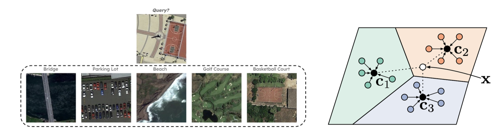

# ml-climate



## Setup
**(Recommended - conda + pip-tools):**
1. Install a new conda environment:
```commandline
$ conda env create -f env/env.yml
```
2. Activate environment:
```commandline
$ conda activate ml-climate
```
3. Sync already compiled requirements:
```commandline
$ pip-sync env/requirements.txt
```
Working environment is now ready to use. The recommended way to add new packages, is to edit `env/requirements.in` and run:
```commandline
$ pip-compile env/requirements.in
```
This line will generate an updated version of the project's `requirements.txt` file, which can be easily synced to the virtual environment with `pip-sync`.

## Usage
To train a ProtoNet on top of a pre-trained model, modify the config file `train_config.yaml` accordingly, and run:
```bash
$ python train_protonet.py --config_path train_config.yaml
```